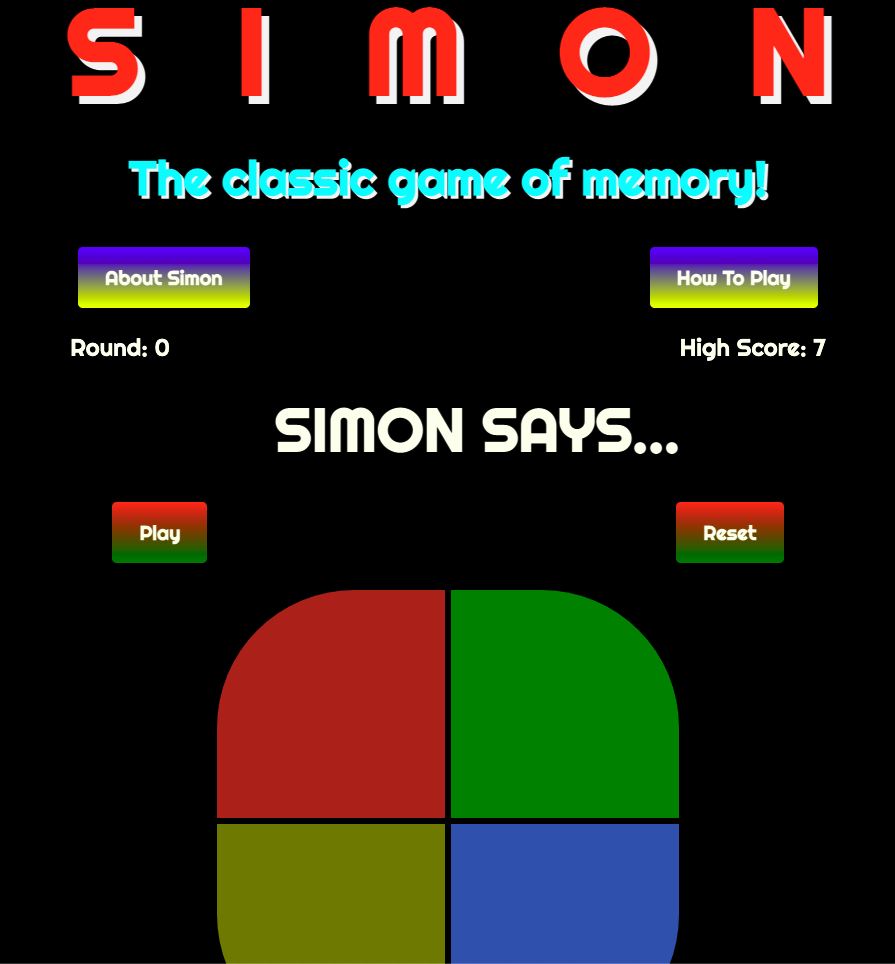

## SIMON-THE GAME

## Project Description

My app is called Simon. It's a game app for players who want to play the Simon game online. One player can join and play rounds of Simon with the score being kept automatically and game rounds displayed at the end of each round. The player continues to play to see how many sequences(rounds) they can complete. The player loses the round when their sequence does not match what Simon's sequence is. Players will have the option to play again if they lose the round. In the future, I'd like to add a feature where the player can choose their difficulty and implement a bigger board with more buttons to make it harder. A Diamond level goal would be to add a feature where I can add tones to the buttons like the classic Simon game.

## User Stories

- As a player, I want my game to be able to have access to the rules of the game so I understand how to play the game.
- As a player, I want my game to display when Simon is running and when it is my turn so I know where the distinction is between the two.
- As a player, I want to see which round I'm on and what my score is so I can keep track of where I stand.
- As a player, I want to be able to stop and start the game when I choose to so I can continue or start over.
- As a player, I want my game to light up on the colored buttons to mimic the real game so you can see each move Simon and I make.

## Wire Frames

> 

### Unsolved Problems / Major Hurdles
